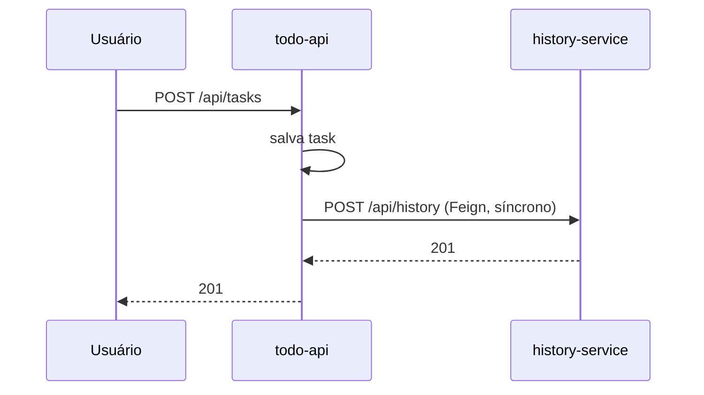
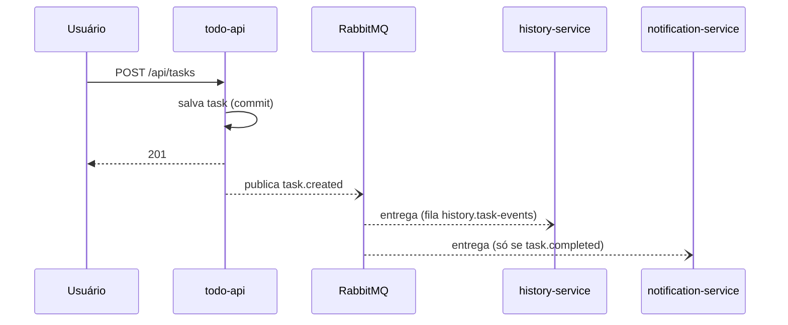
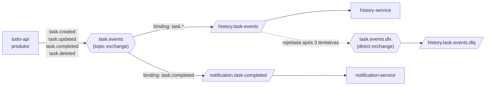
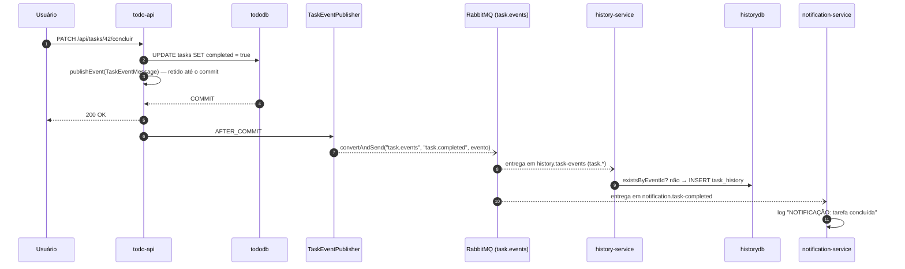
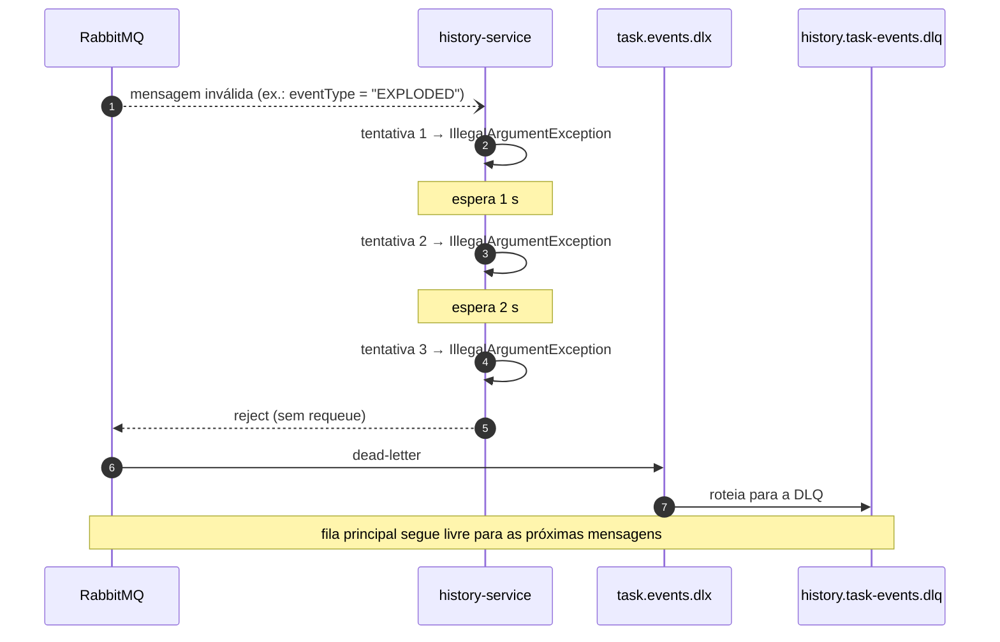
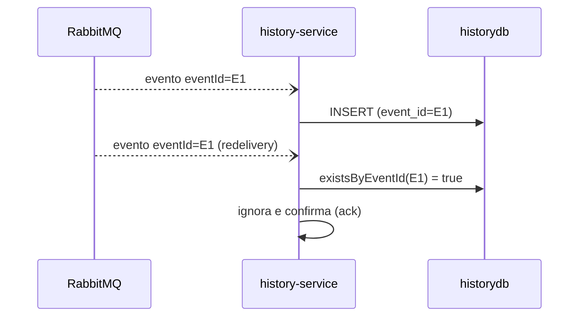
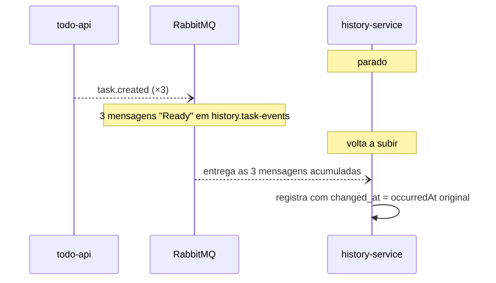

# TP4 — Refatoração para Arquitetura Orientada a Eventos

Documentação da Quarta Entrega do Projeto de Bloco. O sistema (Gerenciador de Tarefas) passou de uma comunicação **síncrona** entre `todo-api` e `history-service` (REST/Feign) para uma arquitetura **orientada a eventos** com **RabbitMQ** como message broker, usando as abstrações do **Spring Boot / Spring AMQP**.

## Sumário

1. [O que mudou](#1-o-que-mudou)
2. [Avaliação da arquitetura orientada a eventos](#2-avaliação-da-arquitetura-orientada-a-eventos)
3. [Topologia no RabbitMQ](#3-topologia-no-rabbitmq)
4. [Contrato da mensagem](#4-contrato-da-mensagem)
5. [Padrões de mensagens implementados](#5-padrões-de-mensagens-implementados)
6. [Fluxos de eventos](#6-fluxos-de-eventos)
7. [Implementação com Spring Boot](#7-implementação-com-spring-boot)
8. [Decisões de projeto e trade-offs](#8-decisões-de-projeto-e-trade-offs)
9. [Como executar](#9-como-executar)
10. [Roteiro de demonstração](#10-roteiro-de-demonstração)
11. [Limitações conhecidas e evoluções](#11-limitações-conhecidas-e-evoluções)
12. [Rastreabilidade com as subcompetências](#12-rastreabilidade-com-as-subcompetências)

---

## 1. O que mudou

### Antes (TP3) — acoplamento temporal via REST



O `todo-api` precisava **conhecer** o `history-service`, **esperar** sua resposta e **tratar sua indisponibilidade** com um `try/catch` (se ele estivesse fora, o histórico daquele evento era simplesmente perdido). Adicionar um segundo interessado no evento (ex.: notificações) exigiria mexer no `todo-api` e adicionar outra chamada síncrona.

### Depois (TP4) — publicação de eventos



O `todo-api` **só conhece o exchange**. Não sabe quantos consumidores existem, nem se estão no ar. Novos consumidores entram no sistema sem nenhuma alteração no produtor — o `notification-service` foi criado exatamente para provar isso.

| Aspecto | TP3 (REST síncrono) | TP4 (eventos) |
| ------- | ------------------- | ------------- |
| Escrita do histórico | `POST /api/history` via Feign | Evento `task.*` no RabbitMQ |
| Se o history-service cair | Evento de histórico perdido | Mensagens ficam na fila durável e são processadas na volta |
| Adicionar novo interessado | Alterar o `todo-api` | Declarar uma fila e ligá-la ao exchange |
| Latência da requisição do usuário | Inclui a chamada ao history-service | Não inclui |
| Consistência do histórico | Imediata (quando funciona) | Eventual (atraso de milissegundos) |
| Consultas (`GET`) | Feign | Feign (inalterado — leituras continuam síncronas) |

---

## 2. Avaliação da arquitetura orientada a eventos

### Prós

- **Baixo acoplamento.** Produtor e consumidores só compartilham um contrato de mensagem. Não há dependência de código, de endereço (URL) nem de disponibilidade simultânea.
- **Escalabilidade e extensibilidade.** Novos consumidores são adicionados sem tocar no produtor. Um mesmo consumidor escala horizontalmente subindo mais instâncias sobre a mesma fila (*competing consumers*).
- **Resiliência.** O broker funciona como buffer durável: se um consumidor cair, as mensagens aguardam. Falhas ficam isoladas — o CRUD de tarefas não é afetado por problemas no histórico.
- **Nivelamento de carga (*load leveling*).** Picos de escrita viram fila, e o consumidor processa no seu ritmo, sem derrubar o banco.
- **Auditoria e rastreabilidade naturais.** Eventos são fatos imutáveis ("a task 42 foi concluída às 10:30"), o que combina com histórico, métricas e integrações futuras.
- **Latência menor para o usuário.** A requisição não espera o processamento dos efeitos colaterais.

### Contras

- **Consistência eventual.** O histórico não reflete a mudança no mesmo instante; a interface precisa tolerar esse intervalo.
- **Complexidade operacional.** Passa a existir mais uma peça de infraestrutura (o broker) para provisionar, monitorar e proteger.
- **Depuração mais difícil.** O fluxo deixa de ser uma pilha de chamadas e passa a atravessar processos; exige logs correlacionados (aqui, o `eventId`) e ferramentas como o painel do RabbitMQ.
- **Entrega *at-least-once*.** Mensagens podem chegar duplicadas ⇒ consumidores precisam ser **idempotentes**.
- **Ordenação não é global.** Com vários consumidores concorrentes, dois eventos da mesma task podem ser processados fora de ordem.
- **Dual write.** Gravar no banco e publicar no broker são duas operações que não compartilham uma transação (ver [seção 8](#8-decisões-de-projeto-e-trade-offs)).
- **Evolução de contrato.** Alterar o formato do evento afeta consumidores que o produtor nem conhece.

### Quando é mais vantajosa

| Cenário | Por que eventos ajudam | Neste projeto |
| ------- | ---------------------- | ------------- |
| Vários serviços reagem ao mesmo fato | *Fan-out* sem o produtor conhecer ninguém | `task.completed` → history **e** notification |
| Efeito colateral não crítico para a resposta ao usuário | Desacopla latência e disponibilidade | Auditoria do histórico |
| Picos de carga ou processamento lento | Fila absorve e nivela | Histórico e notificações |
| Integração entre times/serviços com ciclos de deploy distintos | Contrato estável em vez de chamadas diretas | Serviços independentes |
| Auditoria, trilha de eventos, projeções e métricas | O evento é o próprio registro do fato | `task_history` e estatísticas |

### Quando **não** é a melhor escolha

- Quando o chamador **precisa da resposta agora** para continuar (ex.: validar estoque antes de confirmar um pedido) — é o caso das **consultas** de histórico, que por isso continuam via Feign.
- Sistemas pequenos, um único módulo, CRUD simples: o custo do broker supera o ganho.
- Quando é exigida **consistência forte** imediata entre os dados.

**Conclusão para este projeto:** a extração do histórico é um candidato ideal — é auditoria auxiliar, tem múltiplos interessados potenciais e não deve segurar o fluxo principal. As leituras, por outro lado, permanecem síncronas.

---

## 3. Topologia no RabbitMQ



| Elemento | Tipo | Declarado por | Função |
| -------- | ---- | ------------- | ------ |
| `task.events` | Topic exchange (durável) | todo-api, history-service, notification-service (idempotente) | Ponto de entrada de todos os eventos de task |
| `history.task-events` | Fila durável | history-service | Recebe **todos** os eventos (`task.*`) |
| `notification.task-completed` | Fila durável | notification-service | Recebe **apenas** conclusões (`task.completed`) |
| `task.events.dlx` | Direct exchange (durável) | history-service | Dead Letter Exchange |
| `history.task-events.dlq` | Fila durável | history-service | Guarda mensagens que falharam definitivamente |

Quem consome é **dono da própria fila**; o produtor jamais referencia uma fila.

---

## 4. Contrato da mensagem

```json
{
  "eventId": "6c1c1f0e-8a52-4a53-a1b5-0f3c8a1f7a11",
  "eventType": "COMPLETED",
  "taskId": 42,
  "titulo": "Estudar RabbitMQ",
  "descricao": "TP4",
  "completed": true,
  "occurredAt": "2026-09-20T10:30:00"
}
```

| Campo | Papel |
| ----- | ----- |
| `eventId` | UUID único por evento. Base da **idempotência** no consumidor. |
| `eventType` | `CREATED`, `UPDATED`, `COMPLETED` ou `DELETED`. A *routing key* é `task.` + tipo em minúsculas. |
| `taskId`, `titulo`, `descricao`, `completed` | **Snapshot** do estado da task no momento do evento. |
| `occurredAt` | Quando o fato ocorreu **no produtor**. O consumidor grava este valor (e não o horário de chegada), para que a latência da fila não distorça as métricas de "tempo até a conclusão". |

**Sem biblioteca compartilhada.** Cada serviço tem a própria classe (`record`) para a mensagem. O acoplamento é só o JSON, protegido por **testes de contrato** nos dois lados:

- `todo-api` → `TaskEventMessageContractTest`: garante que o JSON **publicado** tem os campos acima.
- `history-service` → `TaskEventMessageContractTest`: garante que o mesmo JSON é **lido** corretamente e que campos novos são ignorados (*Tolerant Reader*).
- `notification-service` → `TaskCompletedMessageTest`: lê só os 3 campos de que precisa do evento completo.

---

## 5. Padrões de mensagens implementados

| # | Padrão | Onde | Caso de uso atendido |
| - | ------ | ---- | -------------------- |
| 1 | **Publish/Subscribe com roteamento por tópico** | Exchange `task.events` + bindings `task.*` e `task.completed` | Consumidores diferentes interessados em subconjuntos diferentes de eventos |
| 2 | **Fan-out para múltiplos consumidores independentes** | `history.task-events` e `notification.task-completed` | Um evento `task.completed` produz **duas** reações sem que uma saiba da outra |
| 3 | **Event-Carried State Transfer** | Payload com snapshot da task | Consumidor não precisa chamar o `todo-api` de volta |
| 4 | **Competing Consumers** (work queue) | Várias instâncias de `history-service` na mesma fila | Escalar o processamento horizontalmente |
| 5 | **Retry com backoff exponencial** | `spring.rabbitmq.listener.simple.retry.*` (3 tentativas: 1 s, 2 s) | Falhas transitórias (ex.: banco indisponível por instantes) |
| 6 | **Dead Letter Queue (DLQ)** | `task.events.dlx` → `history.task-events.dlq` | *Poison messages* não travam a fila e ficam disponíveis para análise |
| 7 | **Idempotent Consumer** | `event_id` único em `task_history` + `existsByEventId` | Entrega duplicada (at-least-once) não duplica o histórico |
| 8 | **Publish after commit** | `@TransactionalEventListener(AFTER_COMMIT)` | Nunca publicar evento de algo que sofreu rollback |
| 9 | **Tolerant Reader** | `@JsonIgnoreProperties(ignoreUnknown = true)` | Produtor pode evoluir o evento sem quebrar consumidores |

---

## 6. Fluxos de eventos

### 6.1 Fluxo feliz: concluir uma tarefa



Note que a resposta ao usuário (passo 5) **não espera** nem o broker nem os consumidores.

### 6.2 Falha no consumidor: retry e Dead Letter Queue



### 6.3 Entrega duplicada



### 6.4 Consumidor fora do ar



---

## 7. Implementação com Spring Boot

O Spring Boot elimina praticamente todo o código de baixo nível do cliente AMQP:

| Necessidade | Abstração usada | Onde |
| ----------- | --------------- | ---- |
| Dependência e autoconfiguração | `spring-boot-starter-amqp` | `pom.xml` dos 3 serviços |
| Conexão com o broker | `spring.rabbitmq.*` (autoconfigura `ConnectionFactory`, `RabbitTemplate`, `RabbitAdmin`) | `application.properties` |
| Declaração da topologia | Beans `TopicExchange`, `Queue`, `Binding` — o `RabbitAdmin` os cria no broker | `RabbitConfig` |
| Publicar | `RabbitTemplate.convertAndSend` | `TaskEventPublisher` |
| Consumir | `@RabbitListener(queues = ...)` | `TaskEventListener`, `TaskCompletedListener` |
| JSON em vez de serialização Java | Bean `Jackson2JsonMessageConverter` (usa o `ObjectMapper` do Spring) | `RabbitConfig` |
| Retry/backoff e DLQ | Propriedades `spring.rabbitmq.listener.simple.retry.*` + `default-requeue-rejected=false` | `application.properties` do history-service |
| Publicar somente após commit | `@TransactionalEventListener(phase = AFTER_COMMIT)` + `ApplicationEventPublisher` | `TaskService` / `TaskEventPublisher` |

Estrutura dos componentes:

```
todo-api/.../messaging/
├── TaskEventMessage.java     # evento (record) — também é o evento interno do Spring
├── TaskEventPublisher.java   # @TransactionalEventListener(AFTER_COMMIT) → RabbitTemplate
└── RabbitConfig.java         # exchange task.events + conversor JSON

history-service/.../messaging/
├── TaskEventMessage.java     # contrato próprio (Tolerant Reader)
├── TaskEventListener.java    # @RabbitListener(queues = "history.task-events")
└── RabbitConfig.java         # exchange, fila, DLX, DLQ, bindings, conversor JSON

notification-service/.../messaging/
├── TaskCompletedMessage.java
├── TaskCompletedListener.java   # @RabbitListener(queues = "notification.task-completed")
└── RabbitConfig.java
```

**Refatoração do `TaskService`** — antes chamava `historyClient.registrarEvento(...)` dentro de um `try/catch`; agora apenas emite o evento:

```java
private void publicarEvento(Task task, TaskAction action) {
    eventPublisher.publishEvent(TaskEventMessage.of(action, task));
}
```

O `HistoryClient` (Feign) perdeu o método de escrita e ficou só com as consultas. No `history-service`, o `POST /api/history` foi removido: a única porta de entrada para escrever histórico é a fila.

**Alteração de banco (history-service):** migration `V2__add_event_id_to_task_history.sql` adiciona `event_id UUID` com índice único (nulável, pois registros antigos não têm; o Postgres aceita vários `NULL` em índice único).

---

## 8. Decisões de projeto e trade-offs

**Publicar após o commit (e não dentro da transação).** Se o evento fosse enviado antes do commit e o banco fizesse rollback, os consumidores registrariam um fato inexistente. Com `AFTER_COMMIT`, todo evento publicado corresponde a um estado persistido.

**Leituras continuam síncronas.** Consultar histórico/estatísticas exige resposta imediata; usar mensageria aí só traria complexidade (request/reply) sem benefício. Cada estilo de comunicação foi usado onde faz sentido.

**`occurredAt` em vez de "agora" no consumidor.** As estatísticas (tempo até a primeira conclusão, reaberturas) ordenam e subtraem timestamps. Se o consumidor usasse o horário de chegada, uma fila atrasada distorceria as métricas — e a ordenação por `changed_at` continua correta mesmo se mensagens chegarem fora de ordem.

**Idempotência por `eventId`.** O RabbitMQ garante entrega *at-least-once*, não *exactly-once*. A restrição de unicidade no banco é a garantia final; se dois consumidores tentarem gravar o mesmo evento ao mesmo tempo, um deles falha na constraint, o retry o reprocessa e a checagem `existsByEventId` o descarta.

**Mensagem inválida vai para a DLQ, não para o loop infinito.** Com `default-requeue-rejected=false`, uma mensagem que sempre falha não fica voltando para a fila bloqueando as demais.

**Falha de publicação não derruba o CRUD.** O `TaskEventPublisher` captura `AmqpException` e registra em log. Isso mantém a política do TP3 (histórico é auxiliar), mas expõe a limitação abaixo.

**Limitação assumida — *dual write*.** Entre o `COMMIT` no banco e o `convertAndSend` existe uma janela: se o broker estiver indisponível exatamente nesse momento, o evento é perdido (a task existe, o evento não). A solução completa é o **Transactional Outbox**: gravar o evento numa tabela `outbox` **na mesma transação** da task e ter um *relay* que publica as linhas pendentes no broker (com *publisher confirms*). Não foi implementado nesta entrega por ampliar bastante o escopo, mas é a evolução natural (ver seção 11) e o risco é tolerável enquanto o histórico é auditoria auxiliar.

**Ordenação.** Com uma única instância consumidora a ordem é preservada. Com *competing consumers*, dois eventos da mesma task podem ser processados fora de ordem — aceitável aqui porque as consultas ordenam por `occurredAt`, não pela ordem de inserção.

---

## 9. Como executar

Pré-requisitos: Java 17+, Maven 3.8+, Node 18+, Docker.

```bash
# 1. Postgres (x2) + RabbitMQ
cd entrega
docker compose up -d

# 2. Eureka
cd discovery-service && mvn spring-boot:run

# 3. history-service (consumidor)
cd history-service && mvn spring-boot:run

# 4. todo-api (produtor)
cd todo-api && mvn spring-boot:run

# 5. notification-service (consumidor opcional)
cd notification-service && mvn spring-boot:run

# 6. Front-end
cd todo-frontend && npm install && npm run dev
```

Painel do RabbitMQ: <http://localhost:15672> (usuário `todo`, senha `todo`) — abas **Exchanges**, **Queues** e **Connections** mostram a topologia e as mensagens em tempo real.

Testes (não exigem RabbitMQ no ar):

```bash
cd todo-api && mvn test
cd history-service && mvn test
cd notification-service && mvn test
```

---

## 10. Roteiro de demonstração

Cada cenário mostra uma propriedade da nova arquitetura. Acompanhe os logs dos três serviços e o painel do RabbitMQ.

### Cenário 1 — Fluxo básico e fan-out

```bash
curl -X POST localhost:8080/api/tasks -H 'Content-Type: application/json' \
     -d '{"titulo":"Estudar RabbitMQ","descricao":"TP4"}'

curl -X PATCH localhost:8080/api/tasks/1/concluir

curl localhost:8080/api/tasks/1/historico
curl localhost:8080/api/tasks/1/estatisticas
```

Esperado: no log do `todo-api`, `Evento publicado: task.created` e `task.completed`; no `history-service`, `Histórico registrado`; no `notification-service`, `NOTIFICAÇÃO: tarefa #1 ... foi concluída` (**apenas** na conclusão). O histórico mostra os dois eventos.

### Cenário 2 — Resiliência: consumidor fora do ar

1. Pare o `history-service` (Ctrl+C).
2. Crie 3 tarefas: todas retornam `201` normalmente.
3. No painel, **Queues → `history.task-events`**: 3 mensagens em *Ready*.
4. Suba o `history-service` novamente: a fila zera e o histórico das 3 tarefas aparece, com os horários **originais** dos eventos.

No TP3 esse cenário perdia o histórico.

### Cenário 3 — Extensibilidade: novo consumidor sem tocar no produtor

Pare o `notification-service`, conclua uma tarefa e veja a mensagem acumular em `notification.task-completed`. Ao subir o serviço, a notificação é entregue. O `todo-api` não conhece o `notification-service` em nenhum ponto do código.

### Cenário 4 — Mensagem inválida → retry → Dead Letter Queue

No painel: **Exchanges → `task.events` → Publish message**.

- Routing key: `task.created`
- Properties: `content_type=application/json`
- Payload:

```json
{"eventId":"22222222-2222-2222-2222-222222222222","eventType":"EXPLODED","taskId":999,"titulo":"veneno","descricao":null,"completed":false,"occurredAt":"2026-09-20T10:00:00"}
```

Esperado: o log do `history-service` mostra as 3 tentativas (intervalos de ~1 s e ~2 s) e, em seguida, a mensagem aparece em **`history.task-events.dlq`**. A fila principal continua processando eventos normais.

### Cenário 5 — Idempotência (entrega duplicada)

Publique **duas vezes** (mesmo `eventId`) este payload, com routing key `task.created` e `content_type=application/json`:

```json
{"eventId":"11111111-1111-1111-1111-111111111111","eventType":"CREATED","taskId":888,"titulo":"Mensagem manual","descricao":null,"completed":false,"occurredAt":"2026-09-20T10:00:00"}
```

Depois: `curl localhost:8080/api/tasks/888/historico` — retorna **um** evento. O log do `history-service` registra `já processado, ignorando duplicata` para a segunda.

### Cenário 6 — Escalando o consumidor (competing consumers)

```bash
cd history-service
mvn spring-boot:run -Dspring-boot.run.arguments=--server.port=8084
```

Com duas instâncias, **Queues → `history.task-events` → Consumers** lista dois consumidores e as mensagens se dividem entre eles. (Com poucas mensagens, o `prefetch=10` pode entregar todas a uma só instância; para uma divisão visível, envie uma rajada maior ou reduza `spring.rabbitmq.listener.simple.prefetch` para 1.)

### Cenário 7 — Broker indisponível (limitação documentada)

```bash
docker compose stop rabbitmq
curl -X POST localhost:8080/api/tasks -H 'Content-Type: application/json' -d '{"titulo":"sem broker"}'
```

A criação retorna `201` (o CRUD não depende do broker) e o `todo-api` registra `Falha ao publicar evento`. Esse evento **não** é recuperado depois — é a janela de *dual write* descrita na seção 8, que o padrão Transactional Outbox eliminaria.

---

## 11. Limitações conhecidas e evoluções

- **Transactional Outbox** para eliminar a perda de evento na janela commit→publicação, com *publisher confirms* e um relay de reenvio.
- **Testes de integração com RabbitMQ real** (Testcontainers), cobrindo publicação → consumo → DLQ de ponta a ponta. Os testes atuais cobrem cada peça isoladamente e o contrato do JSON.
- **Monitoramento da DLQ** (alerta por tamanho) e rotina de reprocessamento manual das mensagens mortas.
- **Versionamento explícito do evento** (`schemaVersion`) caso o contrato passe a sofrer mudanças incompatíveis.
- **Correlação de logs** propagando `eventId` para o MDC.
- Front-end: o histórico é eventualmente consistente; se necessário, exibir um estado de "carregando" curto ao abrir o histórico logo após criar/editar.

---

## 12. Rastreabilidade com as subcompetências

| Subcompetência | Onde está atendida |
| -------------- | ------------------ |
| **1. Avaliação de arquitetura orientada a eventos** | [Seção 2](#2-avaliação-da-arquitetura-orientada-a-eventos) (prós, contras, cenários) e [seção 8](#8-decisões-de-projeto-e-trade-offs) (trade-offs aplicados ao projeto) |
| **2. Padrões de mensagens** | [Seção 5](#5-padrões-de-mensagens-implementados): pub/sub por tópico, fan-out, competing consumers, retry, DLQ, idempotent consumer, event-carried state transfer, publish-after-commit |
| **3. Implementação com RabbitMQ** | [Seção 3](#3-topologia-no-rabbitmq) (exchange topic, filas duráveis, bindings, DLX/DLQ) e [seção 10](#10-roteiro-de-demonstração) (cenários no painel) |
| **4. Simplificação com Spring Boot** | [Seção 7](#7-implementação-com-spring-boot): `spring-boot-starter-amqp`, `RabbitTemplate`, `@RabbitListener`, `RabbitAdmin`, retry por propriedades |
| **5. Refatoração do sistema** | [Seção 1](#1-o-que-mudou) (antes × depois) e [seção 7](#7-implementação-com-spring-boot) (mudanças no `TaskService`, `HistoryClient`, controller e banco) |
